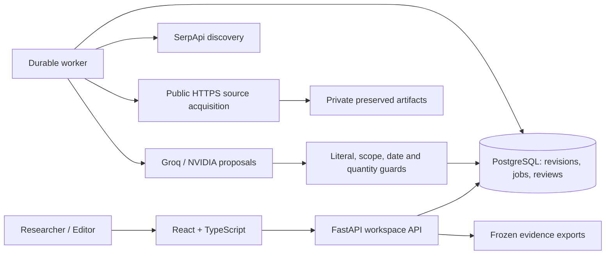

<div align="center">

# FactLedger

### Follow the claim. Preserve the evidence. Make uncertainty visible.

A newsroom investigation workspace for public spending and project delivery claims.

[](https://github.com/sankalp2515/FactLedger/actions/workflows/verify.yml)


[](LICENSE)

[Get started](#get-started) · [Architecture](docs/product-system-spec.md) · [API](docs/api-guide.md) · [Release readiness](docs/release-readiness.md) · [Contributing](CONTRIBUTING.md)

</div>

An announcement can become a headline about completion. An inauguration can become a claim that a hospital is operational. FactLedger helps researchers and editors inspect exactly what collected records establish, with a traceable path from search query to preserved source, literal quotation, scoped finding, editorial decision and frozen evidence pack.


> **Release status:** locally verified first release: 149 backend tests, 14 PostgreSQL evaluations and 19 frontend tests passed. A search-only live approval case completed with validated quotations. Hosted production requires the gates in the [production runbook](docs/runbooks/production.md). Synthetic demonstrations are labelled; automated findings describe collected evidence and do not certify conditions on the ground.

[Desktop workbench](docs/demo/ui-workbench-desktop.png) · [Mobile workbench](docs/demo/ui-workbench-mobile.png) · [Live provider accounting](docs/demo/live-provider-costs.png) · [Submission checklist](docs/submission-checklist.md)

The CI badge reports the repository workflow state; it is not a local test result. Static language and license badges identify the stack and license.

## Why FactLedger

- **Check the actual claim.** Confirm subject, geography, period, delivery stage and quantity before investigating. Keep announcement, approval, funding, completion and operation distinct.
- **Search with a purpose.** SerpApi provides live Search, News and selected Scholar discovery. Inspect queries, provenance, opposing searches and budgets; search snippets never count as evidence.
- **Keep an inspectable trail.** Preserve fetched HTML/PDF records, hashes and text. Accepted quotations have literal text anchors and explicit comparison gaps.
- **Make uncertainty useful.** Expose missing records, partial capture and possible source dependence. Language models propose candidates; deterministic guards and editorial review constrain their use.
- **Hand work to an editor.** Review an immutable case revision, return it for changes or approve a qualified conclusion. Self approval is denied. Later edits do not rewrite an approved pack.
- **Recover durable work.** PostgreSQL jobs use leases, heartbeat, generation fencing and durable provider acknowledgments. Pause, cancel and resume without silently replaying acknowledged searches.

## A typical investigation

1. Create a case and confirm its scope.
2. Inspect the search plan and choose a labelled fixture or live investigation.
3. Use **Evidence** for paginated comparisons and **Sources** for captured originals. Open a record for its full quote and **Jump to quotation**. On mobile, navigate with **Case view**.
4. Add human notes, correct evidence or source-family assumptions and revise the conclusion.
5. Submit the frozen revision to a separate editor, then download a JSON or Markdown pack.

For example, “Hospital A is operational” remains unsupported when a collected document establishes only inauguration. FactLedger exposes the missing operational evidence instead of promoting a related quotation into a stronger conclusion.

## Get started

Requires Docker Desktop with Linux containers and Docker Compose 2.24 or newer. Clone the repository, then start the entire application with one Compose command:

```sh
git clone https://github.com/sankalp2515/FactLedger.git
cd FactLedger
docker compose up --build -d
```

Compose builds the frontend, starts PostgreSQL, runs migrations, then starts the API and durable worker. No separate service commands or local Python/Node installation are needed to run it. Wait for the API to be healthy in Docker Desktop, then open [localhost:8008](http://127.0.0.1:8008). Fixture mode works without a `.env` file.

For live research, copy [.env.example](.env.example) to `.env` once, configure a private `SESSION_SECRET` and the provider keys below, and use the same startup command. Existing `.env` files are retained. `APP_PORT` overrides the port. API and database bind loopback. Development identities let you exercise researcher/editor workflows; production requires OIDC. Never use `docker compose down -v` when retaining cases.

| Setting | Purpose |
|---|---|
| `SERPAPI_API_KEY` | Live search discovery |
| `GROQ_API_KEY` | Groq candidate extraction when selected |
| `NVIDIA_API_KEY` | NVIDIA extraction when selected |
| `LLM_PROVIDER`, `LLM_MODEL` | Extraction provider and model |
| `SESSION_SECRET` | Private signing secret |
| `LOCAL_DB_PASSWORD` | Local Compose database password |

Fixture mode needs no paid provider calls. Live mode needs SerpApi plus the selected LLM provider. Keys stay server-side; never commit `.env`. See [.env.example](.env.example) and the [configuration guide](docs/api-guide.md) for authoritative settings.

## Try it as a judge

Use FactLedger when a public claim needs a defensible evidence trail, especially when an announcement or funding figure is being confused with delivered results.

| Use case | Question to investigate |
|---|---|
| Government schemes | Was the scheme approved, or were benefits actually delivered? |
| Infrastructure | Was a hospital inaugurated, or is it operational in the claimed period? |
| Public spending | Is the cited amount allocated, released or spent? |
| Employment programmes | Does a record count people trained, placed or employed? |
| Editorial review | Can another editor inspect the original record, exact quotation and unresolved gaps? |

**A simple real case:** “The Union Cabinet approved PM-Surya Ghar: Muft Bijli Yojana in February 2024.” The [official PIB release](https://www.pib.gov.in/PressReleasePage.aspx?PRID=2010130&lang=2&reg=48) is a primary record for approval. It does not establish how many households later received installations.

1. Create a case with that claim. Confirm subject `PM-Surya Ghar: Muft Bijli Yojana`, geography `India`, period `2024-02`, stage `APPROVED`; leave quantity fields empty.
2. Review the plan, select **Live search and original records**, and set limits: 2 searches, 6 documents, 1 round, 60,000 tokens, 180 seconds, $0.25 estimated USD. Start with no attached sources so the demo exposes SerpApi discovery itself.
3. Start the investigation. Open its activity to inspect SerpApi queries, source acquisition, provider attempts, tokens and estimates. Integrate the finished or partial run into the draft.
4. Inspect quotations against preserved text and compare the asserted delivery stage. Retain unresolved gaps; a bounded search is not exhaustive verification.
5. Submit a qualified conclusion with citations. Switch to the local **Editor** identity in **Workspace**, inspect the frozen revision, and approve or return it. The submitting researcher cannot approve their own review.
6. Download the JSON evidence pack. Check scope, evidence anchors, gaps, review decisions, hashes and per-run cost estimates.

**Optional manual-source mode:** use **Add source → Source URL → Public source URL → Acquire source** when you already have a record to inspect. Manually attached originals retain their provenance and are separate from search-discovered sources. The earlier measured walkthrough used this mode; it is not proof that a search-only run discovered the official release. See the release audit for actual live measurements.

The final measured search-only approval case **completed with SUPPORTED_BY_COLLECTED_EVIDENCE**: two searches, two document attempts, two validated literal anchors, 4,763 reported tokens, 8.244 seconds and a $0.0230872 configured estimate with zero uncertain reservations or provider errors. Both accepted quotations came from a secondary `pmsvy-cloud.in` article. The acquired government-hosted PDF was unrelated election-expense material and supplied no accepted evidence. Primary-record discovery remains a gap: an editor should separately inspect the official PIB record through the transparent optional manual-source flow. Two earlier runs failed the expected finding and remain documented in the [release audit](docs/release-readiness.md). This selected positive finding describes collected records; it is not independent confirmation of truth or an accuracy benchmark. Follow the [recording script](docs/demo-script.md) for the actual result and a labelled fallback.

Follow the [complete manual testing guide](docs/manual-testing.md) for exact screens, expected results, failure scenarios and the measured live test. If keys are unavailable, use the separately labelled synthetic hospital case in that guide; it makes no provider calls. Facts and provider availability may change, so successful workflow execution does not guarantee a particular automated finding.

## Logs and provider costs

The API and worker emit structured JSON operational logs with request/run identifiers, status, duration and safe error types. Claims, document text, model prompts, credentials and URL query strings are excluded from those logs. Docker rotates each service's logs at 10 MB, retaining three files. View them with `docker compose logs -f --tail=100 api worker`. Durable audit records, run events and cost reservations are stored separately in PostgreSQL; container logs are not a permanent archive.

Every live run reserves its budget before provider calls. **Activity** shows a SerpApi/selected-LLM breakdown, attempts, reported input/output tokens and unknown-outcome reservations. The API and evidence exports include the same `costs` object. Rates and selected provider/model are pinned when the run starts; returned LLM usage reconciles the estimate instead of retaining the larger successful-call reservation. Missing usage or uncertain outcomes keep conservative reservations.

Configure `SERPAPI_SEARCH_USD`, `LLM_INPUT_USD_PER_MILLION` and `LLM_OUTPUT_USD_PER_MILLION` in `.env`. These are estimates, not verified billing: subscription credits, cached searches, free tiers and account pricing can differ. Check provider dashboards for actual charges. Limits control configured estimates and recorded usage, not an external billing account. See the [operations and cost guide](docs/manual-testing.md#logs-and-cost-accounting).

## Architecture



A modular application and separate worker keep this release operable without a broker or Kubernetes. PostgreSQL is authoritative; tenant row-level security and bounded dispatch support a restricted runtime role. Artifacts live on a private shared volume. See the [system specification](docs/product-system-spec.md) and [production runbook](docs/runbooks/production.md).

## Develop and verify

Contributors need Python 3.12, Node.js 22 and pnpm 11; Docker users do not need these tools installed locally.

```powershell
py -3.12 -m venv .venv
.venv/Scripts/python -m pip install -c infra/requirements-runtime.lock -e '.[dev]'
.venv/Scripts/python -m alembic upgrade head
pnpm --dir apps/web install --frozen-lockfile
.venv/Scripts/python -m pytest tests -q
.venv/Scripts/python -m pytest eval/tests -q
.venv/Scripts/python -m ruff check apps/api tests scripts eval migrations
pnpm --dir apps/web exec tsc --noEmit
pnpm --dir apps/web lint
pnpm --dir apps/web test
pnpm --dir apps/web build
.venv/Scripts/python scripts/smoke_fixture.py --base-url http://127.0.0.1:8008
```

PostgreSQL evaluation tests require a disposable test database via `DATABASE_URL`; skipped checks are not passes. The [development guide](docs/api-guide.md) covers editable API, worker and frontend processes. CI runs regression, lint, types, builds, migrations and an actual API/worker fixture journey. Measured results belong in [release readiness](docs/release-readiness.md), rather than unverified badges.

## Documentation

| Guide | Contents |
|---|---|
| [Documentation index](docs/README.md) | Product, engineering and operations references |
| [API and setup](docs/api-guide.md) | Configuration, authentication, requests and errors |
| [Manual testing](docs/manual-testing.md) | Judge walkthrough, real-case results, safe logs and provider estimates |
| [Production deployment](docs/runbooks/production.md) | OIDC, TLS, database privileges, monitoring and release gates |
| [Backup and recovery](docs/runbooks/backup-restore.md) | Restore procedure, deletion replay and retention |
| [Evaluation protocol](eval/README.md) | Synthetic regression and independent evaluation requirements |
| [Hackathon submission](docs/submission-readiness.md) | Judging evidence, recording outline and AI disclosure |
| [Submission checklist](docs/submission-checklist.md) | Engineering handoff and participant-owned final steps |
| [Demo script](docs/demo-script.md) | A 2:50 local recording with measured limits and transparent fallback |
| [Security policy](SECURITY.md) | Private reporting and security boundaries |
| [Changelog](CHANGELOG.md) | First-release capabilities and limitations |

## Limitations

Public records can be missing, stale or unavailable. Scanned PDFs need OCR, which this release does not provide; tables and partial extraction need inspection. Source families are hypotheses, not proof of independence. Cost estimates depend on configured provider rates. Provider failures and incomplete opposing coverage remain visible as partial results. Synthetic tests do not replace independent adjudication or a newsroom pilot. A human editor remains responsible for any published conclusion.

## Contributing and license

Follow [CONTRIBUTING.md](CONTRIBUTING.md). Report defects with reproduction steps and keep credentials/private records out of issues. Report security concerns privately as described in [SECURITY.md](SECURITY.md).

Released under the [MIT License](LICENSE), copyright 2026 Sankalp. Third-party software and captured public records retain their own rights and terms. The demo video link will be added after the participant records and uploads it; no hosted production deployment is claimed.

Built with FastAPI, React, PostgreSQL, SerpApi and selectable Groq/NVIDIA adapters. AI-assisted engineering and synthetic evaluation are disclosed in the [submission guide](docs/submission-readiness.md).

Interface friction fixes, responsive checks and keyboard test steps are documented in the [UI/UX audit](docs/ui-ux-audit.md).
