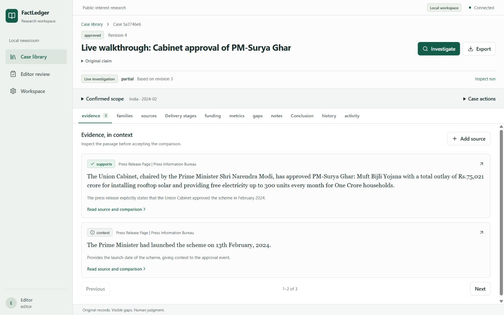
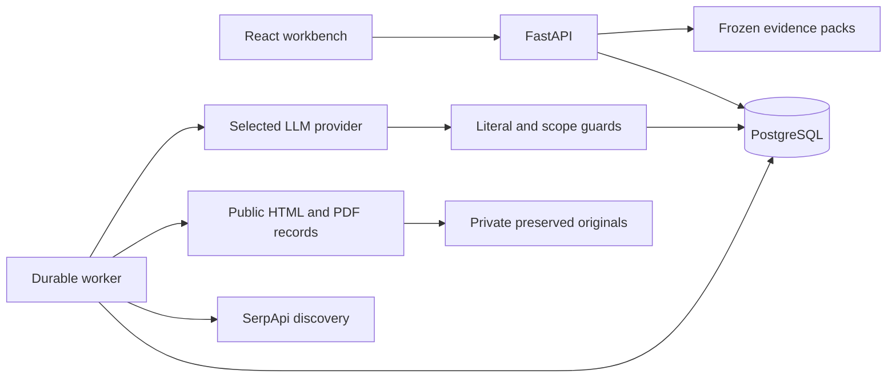

<div align="center">

# FactLedger

### Follow the claim. Preserve the evidence. Make uncertainty visible.

A newsroom investigation workspace for public spending and project delivery claims.

[](https://github.com/sankalp2515/FactLedger/actions/workflows/verify.yml)


[](LICENSE)

[Get started](#get-started) · [User flows](docs/user-flows.md) · [Architecture](docs/architecture.md) · [API guide](docs/api-guide.md) · [Design](docs/design.md)

</div>

An announcement can become a headline about completion. An inauguration can become a claim that a hospital is operational. FactLedger helps researchers and editors inspect what collected records establish, with a traceable path from search query to preserved source, literal quotation, scoped finding, editorial decision and frozen evidence pack.



*Interface from a live public-record walkthrough with a manually attached PIB source.*

## Why FactLedger

- **Check the actual claim.** Confirm subject, geography, period, delivery stage and quantity. Keep approval, funding, completion and operation distinct.
- **Search with a purpose.** SerpApi supplies live Search, News and selected Scholar discovery. Inspect primary-record and opposing queries, provenance and budgets; snippets never count as evidence.
- **Keep an inspectable trail.** Preserve originals, hashes and extracted text. Accepted quotations have literal anchors and explicit comparison gaps.
- **Make uncertainty useful.** Expose missing records, partial capture and possible source dependence. Models propose candidates; deterministic guards constrain their use.
- **Hand work to an editor.** Submit a frozen revision to a separate editor. Self approval is denied; later edits do not rewrite an approved pack.
- **Recover durable work.** PostgreSQL jobs use leases, heartbeat, generation fencing and durable provider acknowledgments.

## Get started

Requires Docker Desktop with Linux containers and Docker Compose 2.24 or newer.

```sh
git clone https://github.com/sankalp2515/FactLedger.git
cd FactLedger
docker compose up --build -d
```

One Compose command builds the frontend, starts PostgreSQL, applies migrations and starts the API and worker. Wait for the API to be healthy in Docker Desktop, then open [localhost:8008](http://127.0.0.1:8008) and select **Open workspace**. The homepage introduces the workflow, examples and costs. No local Python or Node installation is needed. **Synthetic fixture mode works without API keys or a `.env` file.**

For live research, copy [.env.example](.env.example) to `.env` once, set a private `SESSION_SECRET`, `SERPAPI_API_KEY`, and one selected LLM provider's key. Set `LLM_PROVIDER` explicitly and leave `LLM_MODEL` blank for its default. Reapply the same startup command after configuration changes. Preserve an existing `.env` and never commit it.

| Provider | LLM_PROVIDER | Required LLM key | Default model |
|---|---|---|---|
| Groq | `groq` | `GROQ_API_KEY` | `openai/gpt-oss-120b` |
| NVIDIA | `nvidia` | `NVIDIA_API_KEY` | `meta/llama-3.3-70b-instruct` |
| OpenAI | `openai` | `OPENAI_API_KEY` | `gpt-4.1-mini` |
| Anthropic | `anthropic` | `ANTHROPIC_API_KEY` | `claude-sonnet-4-6` |
| Gemini | `gemini` | `GEMINI_API_KEY` | `gemini-2.5-flash` |

Only the selected LLM key is needed alongside SerpApi. These are direct provider APIs; account access, model compatibility and quotas still apply. Keys stay server-side. Configure cost rates for the selected model/account; example rates are estimates, not universal prices. See [configuration and provider protocols](docs/api-guide.md#environment-and-setup).

`APP_PORT` overrides port 8008. API/database bind loopback. Local identities exercise researcher/editor roles; public hosting requires OIDC and the [hosting prerequisites](docs/architecture.md#hosting-and-recovery). Never delete persistent volumes when retaining cases.

### Your workspace data

A fresh installation starts with an empty case library and local Researcher, Editor and Owner identities. Cases and investigation runs shown in screenshots or demonstrations are not bundled with the repository. Create your own case using either example below; the synthetic example requires no provider keys.

Cases, run history and review records persist in your installation's PostgreSQL volume; preserved originals and exports use a separate artifact volume. Restarting Compose retains them. Another machine has its own workspace and provider configuration. Live search results can change, so repeating a claim may produce different evidence or an incomplete outcome.

## When to use it

| Use case | Question |
|---|---|
| Government schemes | Was a scheme approved, or were benefits delivered? |
| Infrastructure | Was a hospital inaugurated, or operational in the claimed period? |
| Public spending | Was money allocated, released or spent? |
| Employment programmes | Does the record count people trained, placed or employed? |
| Editorial review | Can another editor inspect originals, quotations and unresolved gaps? |

### Try an investigation

**Start without API keys:** create **“Hospital A is operational in District A during September 2026.”** Confirm subject `Hospital A`, geography `District A`, period `2026-09` and stage `OPERATIONAL`. Select **Synthetic fixture · evaluation only**, then inspect the inauguration/operation mismatch, submit a qualified conclusion for review and export the record. This is fictional test data, not a live finding.

### Live walkthrough: inspect an inauguration record

Create **“Atal Setu was inaugurated in Navi Mumbai in January 2024.”** Confirm subject `Atal Setu`, geography `Navi Mumbai`, period `2024-01` and stage `INAUGURATED`. Leave quantity fields blank.

1. In **Add source**, acquire the [official PIB release](https://www.pib.gov.in/Pressreleaseshare.aspx?PRID=1995650&lang=2&reg=48). This is a known source attached manually; its provenance remains visible.
2. Generate and inspect the research plan. Choose **Live search and original records** with limits of 12 searches, 30 documents, 1 round, 60,000 tokens, 600 seconds and $2 estimated cost. These are ceilings, not promised charges; set provider rates for your account.
3. Start the investigation, inspect its activity and integrate terminal results into the case. Provider availability and rate limits can affect the outcome.
4. Inspect the PIB inauguration sentence with **Jump to quotation** and compare its stage, location and period with the claim. A related construction-cost passage does not establish inauguration. Review the actual guarded relations and gaps rather than assuming every collected passage supports the claim.
5. Write a qualified conclusion citing the inspected passage, submit its frozen revision, switch to Editor for a separate review decision, then export HTML, JSON or Markdown. This demonstrates separate local roles, not an independent external review.

This workflow was exercised end to end with live providers. Its conclusion concerns the collected inauguration record; it does not establish later operation, traffic benefits or expenditure, and repeated searches need not reproduce the same finding.

### Another public-record example

Use the claim **“The Union Cabinet approved PM-Surya Ghar: Muft Bijli Yojana in February 2024.”** Confirm subject `PM-Surya Ghar: Muft Bijli Yojana`, geography `India`, period `2024-02`, stage `APPROVED`; leave quantities blank.

1. Create the case and confirm scope.
2. Generate and inspect the research plan. Select **Live search and original records** and bounded limits: 2 searches, 6 documents, 1 round, 60,000 tokens, 180 seconds and $0.25 configured estimate. Adjust the estimate for your provider rates if needed.
3. Begin without attached sources. Open **Inspect run** to see SerpApi queries, acquisition, failures and costs. Integrate terminal results.
4. Inspect each original and literal quotation. Use **Jump to quotation** and read comparison gaps. If the primary record is missing, acquire the [PIB release](https://www.pib.gov.in/PressReleasePage.aspx?PRID=2010130&lang=2&reg=48) through **Add source**; its manual provenance remains visible.
5. Write a qualified conclusion, select inspected citations and submit for review. Switch to Editor, inspect the frozen revision and decide. Export JSON or Markdown.

Approval does not establish later installations. Search availability and provider limits can leave a partial or insufficient finding; a secondary quotation does not replace primary confirmation. An editor remains accountable for the conclusion.

See [complete user flows](docs/user-flows.md) for research, review and recovery states.

## Logs and provider costs

The API/worker emit structured operational logs with safe identifiers, status, duration and error types. Source text, prompts, credentials and URL query strings are excluded. View logs with `docker compose logs -f --tail=100 api worker`. Compose rotates each service's logs at 10 MB with three files; durable audit/events are stored separately in PostgreSQL.

Every run reserves budget before provider calls. **Activity**, the run API and exports show per-provider attempts, input/output tokens, estimated USD and uncertain reservations. Provider/model and rates are pinned at start. Valid reported usage reconciles successful calls; missing usage and unknown outcomes retain conservative reservations.

Set `SERPAPI_SEARCH_USD`, `LLM_INPUT_USD_PER_MILLION` and `LLM_OUTPUT_USD_PER_MILLION` for your account. These are configured estimates, not verified invoices; subscriptions, caching and free tiers can differ. Check provider dashboards for actual charges. [More accounting details](docs/api-guide.md).

## Architecture



A modular application and separate worker keep operations simple. PostgreSQL is authoritative; models do not grant editorial authority. See [architecture, persistence and recovery](docs/architecture.md).

## Develop and verify

Contributors need Python 3.12, Node.js 22 and pnpm 11. Install the API with runtime constraints and use the frontend lockfile:

```sh
python -m pip install -c infra/requirements-runtime.lock -e '.[dev]'
pnpm --dir apps/web install --frozen-lockfile
python -m pytest tests -q
python -m pytest eval/tests -q
python -m ruff check apps/api tests scripts eval migrations
python -m ruff format --check apps/api tests scripts eval migrations
pnpm --dir apps/web exec tsc --noEmit
pnpm --dir apps/web lint
pnpm --dir apps/web test
pnpm --dir apps/web build
python scripts/smoke_fixture.py --base-url http://127.0.0.1:8008
```

PostgreSQL evaluations require a disposable test database via `DATABASE_URL`; skipped checks are not passes. CI checks backend regressions, PostgreSQL evaluations/migrations, frontend types/lint/tests/build, publication safety, and an actual key-free Compose investigation/review/export journey. Provider protocol tests use controlled HTTP responses; real account availability needs live credentials. See [CONTRIBUTING.md](CONTRIBUTING.md).

## Documentation

| Guide | Contents |
|---|---|
| [Architecture](docs/architecture.md) | Components, persistence, security and hosting/recovery |
| [User flows](docs/user-flows.md) | Real-record and key-free workflows |
| [API guide](docs/api-guide.md) | Routes, authentication, configuration, errors and costs |
| [Design](docs/design.md) | Interface hierarchy, components, accessibility and responsive behaviour |

## Limitations

Public records can be missing, stale or unavailable. Scanned PDFs require OCR outside this release. Tables, partial extraction and source-family hypotheses need inspection. Provider failures and incomplete opposing coverage remain visible. Synthetic tests do not establish independent accuracy or production capacity. Shared local artifact storage constrains multi-host deployment; public hosting requires further operational preparation.

## Contributing and license

Contributions follow [CONTRIBUTING.md](CONTRIBUTING.md). Keep private records and credentials out of issues; report security concerns through [SECURITY.md](SECURITY.md). See [CHANGELOG.md](CHANGELOG.md) for release changes.

Released under the [MIT License](LICENSE), copyright 2026 Sankalp. Third-party software and captured records retain their own rights. AI-assisted tools supported development and testing; synthetic evaluation remains labelled. Humans remain responsible for reviewed and published conclusions.
