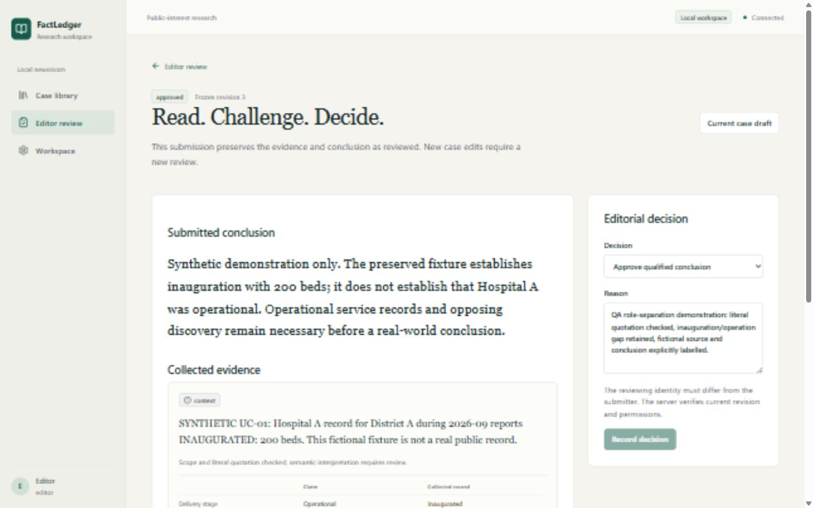
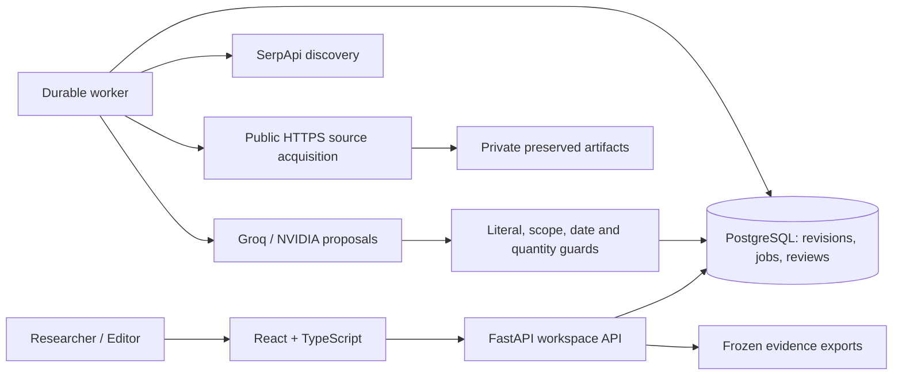

<div align="center">

# FactLedger

### Follow the claim. Preserve the evidence. Make uncertainty visible.

A newsroom investigation workspace for public spending and project delivery claims.

[Get started](#get-started) · [Architecture](docs/product-system-spec.md) · [API](docs/api-guide.md) · [Release readiness](docs/release-readiness.md) · [Contributing](CONTRIBUTING.md)

</div>

An announcement can become a headline about completion. An inauguration can become a claim that a hospital is operational. FactLedger helps researchers and editors inspect exactly what collected records establish, with a traceable path from search query to preserved source, literal quotation, scoped finding, editorial decision and frozen evidence pack.



> **Release status:** working local first release under verification. Hosted production requires the gates in the [production runbook](docs/runbooks/production.md). Synthetic demonstrations are labelled; automated findings describe collected evidence and do not certify conditions on the ground.

## Why FactLedger

- **Check the actual claim.** Confirm subject, geography, period, delivery stage and quantity before investigating. Keep announcement, approval, funding, completion and operation distinct.
- **Search with a purpose.** SerpApi provides live Search, News and selected Scholar discovery. Inspect queries, provenance, opposing searches and budgets; search snippets never count as evidence.
- **Keep an inspectable trail.** Preserve fetched HTML/PDF records, hashes and text. Accepted quotations have literal text anchors and explicit comparison gaps.
- **Make uncertainty useful.** Expose missing records, partial capture and possible source dependence. Language models propose candidates; deterministic guards and editorial review constrain their use.
- **Hand work to an editor.** Review an immutable case revision, return it for changes or approve a qualified conclusion. Self approval is denied. Later edits do not rewrite an approved pack.
- **Recover durable work.** PostgreSQL jobs use leases, heartbeat, generation fencing and durable provider acknowledgments. Pause, cancel and resume without silently replaying acknowledged searches.

## A typical investigation

1. Create a case and confirm its scope.
2. Inspect the search plan and choose a labelled fixture or live investigation.
3. Inspect sources, literal quotations, stage comparisons and unresolved gaps.
4. Add human notes, correct evidence or source-family assumptions and revise the conclusion.
5. Submit the frozen revision to a separate editor, then download a JSON or Markdown pack.

For example, “Hospital A is operational” remains unsupported when a collected document establishes only inauguration. FactLedger exposes the missing operational evidence instead of promoting a related quotation into a stronger conclusion.

## Get started

Requires Docker Desktop with Linux containers. Development tools: Python 3.12, Node.js 22 and pnpm 11.

```powershell
if (-not (Test-Path .env)) { Copy-Item .env.example .env }
# Edit .env locally: configure a private SESSION_SECRET and keys for live runs.
docker compose -f infra/compose.yml up --build -d
Invoke-RestMethod http://127.0.0.1:8008/health/ready
```

Open [localhost:8008](http://127.0.0.1:8008). `APP_PORT` overrides the port. API and database bind loopback. Development identities let you exercise researcher/editor workflows; production requires OIDC. Never use `docker compose down -v` when retaining cases.

| Setting | Purpose |
|---|---|
| `SERPAPI_API_KEY` | Live search discovery |
| `GROQ_API_KEY` | Groq candidate extraction when selected |
| `NVIDIA_API_KEY` | NVIDIA extraction when selected |
| `LLM_PROVIDER`, `LLM_MODEL` | Extraction provider and model |
| `SESSION_SECRET` | Private signing secret |
| `LOCAL_DB_PASSWORD` | Local Compose database password |

Fixture mode needs no paid provider calls. Live mode needs SerpApi plus the selected LLM provider. Keys stay server-side; never commit `.env`. See [.env.example](.env.example) and the [configuration guide](docs/api-guide.md) for authoritative settings.

## Architecture



A modular application and separate worker keep this release operable without a broker or Kubernetes. PostgreSQL is authoritative; tenant row-level security and bounded dispatch support a restricted runtime role. Artifacts live on a private shared volume. See the [system specification](docs/product-system-spec.md) and [production runbook](docs/runbooks/production.md).

## Develop and verify

```powershell
py -3.12 -m venv .venv
.venv/Scripts/python -m pip install -c infra/requirements-runtime.lock -e '.[dev]'
.venv/Scripts/python -m alembic upgrade head
pnpm --dir apps/web install --frozen-lockfile
.venv/Scripts/python -m pytest tests -q
.venv/Scripts/python -m pytest eval/tests -q
.venv/Scripts/python -m ruff check apps/api tests scripts eval migrations
pnpm --dir apps/web exec tsc --noEmit
pnpm --dir apps/web lint
pnpm --dir apps/web test
pnpm --dir apps/web build
.venv/Scripts/python scripts/smoke_fixture.py --base-url http://127.0.0.1:8008
```

PostgreSQL evaluation tests require a disposable test database via `DATABASE_URL`; skipped checks are not passes. The [development guide](docs/api-guide.md) covers editable API, worker and frontend processes. CI runs regression, lint, types, builds, migrations and an actual API/worker fixture journey. Measured results belong in [release readiness](docs/release-readiness.md), rather than unverified badges.

## Documentation

| Guide | Contents |
|---|---|
| [Documentation index](docs/README.md) | Product, engineering and operations references |
| [API and setup](docs/api-guide.md) | Configuration, authentication, requests and errors |
| [Production deployment](docs/runbooks/production.md) | OIDC, TLS, database privileges, monitoring and release gates |
| [Backup and recovery](docs/runbooks/backup-restore.md) | Restore procedure, deletion replay and retention |
| [Evaluation protocol](eval/README.md) | Synthetic regression and independent evaluation requirements |
| [Hackathon submission](docs/submission-readiness.md) | Judging evidence, recording outline and AI disclosure |
| [Security policy](SECURITY.md) | Private reporting and security boundaries |
| [Changelog](CHANGELOG.md) | First-release capabilities and limitations |

## Limitations

Public records can be missing, stale or unavailable. Scanned PDFs need OCR, which this release does not provide; tables and partial extraction need inspection. Source families are hypotheses, not proof of independence. Cost estimates depend on configured provider rates. Provider failures and incomplete opposing coverage remain visible as partial results. Synthetic tests do not replace independent adjudication or a newsroom pilot. A human editor remains responsible for any published conclusion.

## Contributing and license

Follow [CONTRIBUTING.md](CONTRIBUTING.md). Report defects with reproduction steps and keep credentials/private records out of issues. Report security concerns privately as described in [SECURITY.md](SECURITY.md).

The owner is selecting a public license. Until one is added, this repository does not grant an open-source reuse license. Public repository/demo links will be added after publication; none are claimed here.

Built with FastAPI, React, PostgreSQL, SerpApi and selectable Groq/NVIDIA adapters. AI-assisted engineering and synthetic evaluation are disclosed in the [submission guide](docs/submission-readiness.md).
