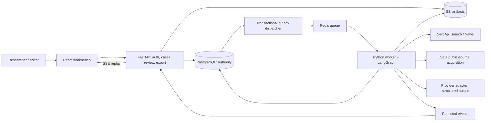
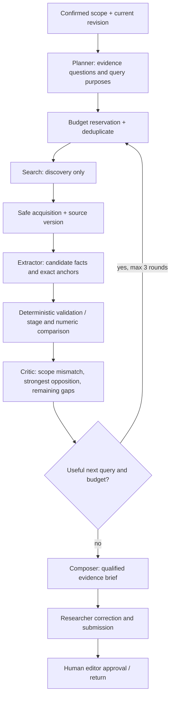

# FactLedger — AI agent integration and system design
8 October 2026 · Normative design supplement to PRD and product-system-spec

## 1. System boundaries

Backend modules: Cases, Runs, Search, Acquisition, Evidence, Review, Reports, Platform. A worker imports the same typed domain package; it does not duplicate domain models or bypass domain authorization. Local stack uses PostgreSQL, Redis and MinIO in Compose, avoiding hosted accounts. Production may replace storage/identity through adapters without changing the evidence semantics.

The AI has limited research authority. Only server-side adapters execute tools. A model cannot write arbitrary SQL, access secrets, publish findings, invite members, purchase services or fetch arbitrary network destinations.

## 2. Agent graph

These are specialist nodes in one controlled graph, not autonomous conversational agents or separate services. Use model calls only where semantics require them; search/fetch/normalization/persistence/budgets/arithmetic remain ordinary software.

| Node | Input → output | Authority and rejection rules |
|---|---|---|
| Scope assistant | Original claim → proposed atomic ClaimScope[] | Proposes only; researcher confirms ambiguous date/project/quantity/stage |
| Planner | Confirmed scopes + gaps → QueryPlan[] | Each query declares purpose, engine, target evidence and stop condition; max 3 active claims |
| Discovery executor | Authorized SearchRequest → SearchBatch | Google Search primary; News for reporting/history; Scholar for methodology only; stores params/rank/time |
| Acquisition executor | Selected SourceRef → SourceVersion | HTTPS/public only, all IPs/redirects checked; no snippet promotion; access failure stored |
| Extractor | SourceVersion text + scope → CandidateEvidence[] | Must return exact quote and anchor, attribution, stage/measure and dates or unknown |
| Validator/comparator | CandidateEvidence → validated Evidence / rejection | Pure checks bind quote to source, enforce comparable scope, normalize units and reject unsupported links |
| Critic | EvidenceSet + ledger → Gaps[] + proposed next query | Looks for primary records/opposition, ambiguity, shared source ancestry; cannot invent evidence |
| Composer | Validated IDs + gaps → structured draft | Every factual sentence binds evidence IDs; no unsupported allegation; uncertainty explicit |

Model portability: one provider adapter with structured schema output and usage accounting. Engineering selects a capable structured-output model against evaluations once a key is available. Do not assume that every OpenAI-compatible provider has identical JSON schema, token accounting or cancellation semantics.

## 3. State and tool contracts

InvestigationState contains workspace_id, case_id, revision_id, run_id, confirmed_claims, query_plan, searched_query_fingerprints, source_version_ids, evidence_ids, stage_observations, funding_observations, gaps, round, budget, checkpoint_cursor and draft. Persist references and compact state; raw document content belongs in artifacts, not the graph checkpoint or browser event stream.

Typed proposals:
- QueryPlan: claim_id, purpose enum PRIMARY_RECORD / STATUS / OPPOSING / DEFINITION, query, engine, expected_evidence, rationale.
- CandidateEvidence: claim_id, source_version_id, quote, anchor, relation, attributed_to, event_date?, reference_period?, stage?, measure_kind?, original_value?, unit?, limitations.
- Gap: claim_id, type, reason, next_evidence_needed, proposed_query?, priority.
- Draft: factual_sentences[{text,evidence_ids}], interpretation, limitations, unanswered_questions. Interpretation is labelled; citation-free factual sentences cannot be saved as a grounded brief.

Existing SearchRequest/SearchBatch/SourceVersion/EvidenceSet/RunBudget interfaces in the implementation plan remain the shared boundary. Add StageObservation and FundingObservation to shared contracts, not as a second incompatible model family.

Tool allowlist: search_public(SearchRequest), acquire_public(SourceRef), read_source_version(id, bounded_ranges), compare_quantities(typed_operands), propose_relation(typed_candidate). Scoped service methods persist validated results. No shell, general MCP, email, social publishing, arbitrary filesystem or unrestricted browser tool is exposed to product agents.

## 4. Orchestration, cost and correctness

Every step: load expected revision → check cancellation/lease → reserve worst-case action budget transactionally → execute adapter → persist outcome, reconcile usage, event and checkpoint → continue. Store idempotent action key (run,node,input_hash,version); duplicate committed steps return persisted results.

External calls are not transactionally exactly-once. A crash after provider acceptance can leave a charged request without a result. Mark uncertain charge, avoid blind free replay, conservatively account reservation, and expose recovery policy. An outbox prevents lost dispatch, not external duplicate charges.

Budget: 12 uncached search attempts, 30 documents, 3 rounds, 60k billed model tokens, 10 running minutes, USD 2 estimated cap. Ceilings coexist; reaching any stops new work. Reserve model max output and known input estimate; pricing is configurable with dated metadata. Max 2 transient retries per action consume same budget. Hard errors such as invalid key do not enter retry loops.

Stop decisions: adequate collected evidence with no material unresolved contradiction; no useful nonduplicate query; no accessible primary record; budgets; cancellation. “Adequate” means draftable with qualifications, not objectively true. All decisive unresolved gaps remain in output. More agents cannot manufacture unavailable records.

Run state QUEUED/RUNNING/PAUSED/READY/FAILED/CANCELLED is distinct from editorial case state. Lease 60 seconds with heartbeat. Resume paused checkpoint with remaining budget; start a new run after terminal states. SSE event IDs permit replay after refresh. Never reset token/cost budget on crash or pause.

## 5. Prompt injection and safety

Retrieved text, PDFs, titles and snippets are untrusted. Include content only in delimited data fields; instructions in content have no authority. Schema checks do not alone prevent injection: combine least-privilege adapters, tenant-bound IDs, egress restrictions, no credentials in prompts and deterministic anchor validation. An adversarial source asking the model to fetch an internal address or approve a conclusion must fail safely.

Cannot approve, publish or determine a universal truth score. Cannot silently change a confirmed claim, erase opposition or merge unrelated projects. Override requires actor/reason/version; editor approval binds immutable revision. Do not expose model chain-of-thought. Show short decision rationales, tool trace, citations and costs instead.

## 6. Human authority and engineering tests

Researcher confirms scope, edits evidence mappings and writes conclusion. Editor decides whether the evidence supports publication. Engineering owns implementation and tests; project reviewer supplies credentials/accounts and finalizes frontend, not each run.

Required graph tests: ambiguity; inauguration≠operation; allocated≠spent; old-vs-current date; wrong district; duplicate reports; quote mismatch; missing documents; adversarial source; budget exhaustion; provider timeout; crash after reservation; cancellation; old-revision review. Use replayable provider fixtures plus labelled live smoke tests. Report model/provider/version, prompt hash, dataset version, precision/coverage, token/search costs and unresolved limitations.

Changing model or prompts reruns these tests. No benchmark success is claimed until measured.
