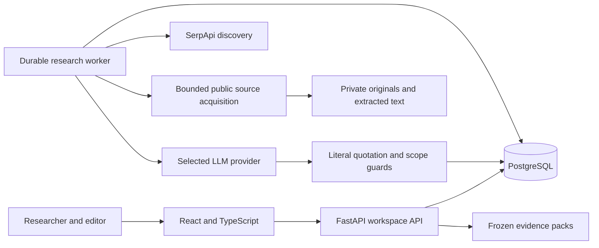
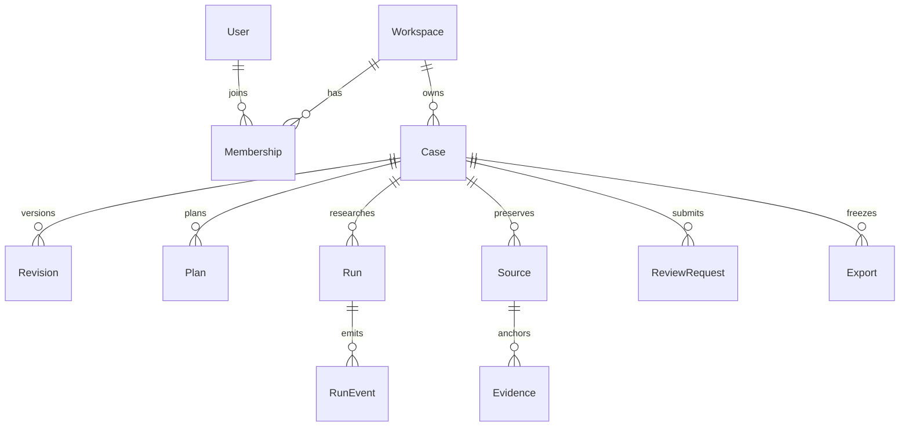

# Architecture

FactLedger is a modular investigation workspace. A same-origin React application calls a FastAPI API; a separate worker performs bounded research. PostgreSQL owns case revisions, jobs, evidence, review decisions and audit events. Captured originals and exports live in a private shared artifact volume.

## Boundaries and data flow

| Module | Responsibility |
|---|---|
| `apps/api/product_core/domain` | Deterministic comparisons of subject, geography, period, stage and quantities |
| `service.py`, `schemas.py`, `main.py` | Revisioned application commands, validation and REST presentation |
| `auth.py`, `db.py`, `models.py` | Identity, tenant transactions and persistence |
| `investigation/` | Query planning, provider protocols, safe acquisition, extraction, budgets and checkpoints |
| `worker.py` | Durable job dispatch, leases and recovery |
| `apps/web/src` | Workbench, role workflows and typed API client |
| `migrations/`, `infra/`, `scripts/` | Schema changes, containers and operational utilities |

Scope confirmation precedes planning. SerpApi Google Search, News and selected Scholar queries produce discovery leads with query/rank provenance. The worker acquires the underlying public records; snippets cannot become evidence. Models propose candidate quotations and comparison fields. Literal anchors and deterministic scope checks validate those proposals before findings are composed. Researchers integrate run-owned results into a new revision, then submit a frozen conclusion to a separate editor.

The selected model is Groq, NVIDIA, OpenAI, Anthropic or Gemini. Each uses a fixed provider host and its own protocol where needed. No model tools or arbitrary provider base URLs are enabled. Providers receive bounded excerpts of acquired text and claim scope. They cannot approve an editorial conclusion. Credentials remain server-side. There is no silent provider fallback.

## Persistence

Workspace/case ownership is enforced by composite relationships and application transactions. PostgreSQL tenant tables use row-level security and transaction-local workspace context. Revision numbers and ordered run event sequences have uniqueness constraints; ownership/state indexes support bounded dispatch and case navigation. Sources and evidence retain immutable captured records; human corrections are revisioned rather than rewriting originals. Alembic owns schema evolution; CI checks PostgreSQL migrations and model drift.

Mutations carry `expected_revision` to reject stale edits. Research starts are idempotent. Worker leases use generations to fence stale workers. Reservations are persisted before paid calls; checkpoints acknowledge outcomes before reuse. Unknown provider outcomes retain reservations instead of silently repeating calls. Pause/cancel stops new dispatch but cannot undo already submitted provider work. SSE replays durable ordered events.

## Costs, security and scale

Search/model choice and configured rates are pinned per run. Reported model usage reconciles successful calls; missing usage preserves conservative reservations. Gemini thought tokens count toward output accounting. Anthropic reported cache input tokens count conservatively at the configured input rate. Account-specific caching discounts and invoices are not synchronized. See [API configuration](api-guide.md).

Cookie mutations require CSRF tokens. Production uses OIDC; local development role switching is unavailable in production mode. Downloads recheck tenant/case access. Acquisition validates public HTTPS targets, redirects and resolved addresses; it bounds bytes, pages and duration. Provider errors are safe codes, and operational logs exclude source text, prompts and credentials.

A modular application and PostgreSQL worker queue avoid unnecessary broker/service overhead. This release uses a shared local volume, which constrains multi-host scaling. Multi-host deployment needs a deliberately designed object-storage adapter, restricted artifact access, load testing and measured capacity. There is no claim of verified million-user capacity.

## Hosting and recovery

Local Compose binds loopback and forces development mode. Public hosting requires a separate TLS deployment, private database/storage networking, `MODE=production`, a high-entropy session secret, registered OIDC issuer/client, exact HTTPS public origin and allowed hosts. The callback is `/v1/auth/callback`. Configure an independently verified identity with the maintenance-only `scripts/bootstrap_oidc.py`; the API does not grant membership to arbitrary OIDC accounts.

Use a dedicated runtime PostgreSQL login belonging to `evidence_app`, without ownership, superuser or BYPASSRLS privileges. Run migrations with separate maintenance credentials. API/worker use `evidence_claim_runs()` for bounded dispatch, then return to tenant-scoped transactions. Keep the nonroot, read-only container and resource limits; configure private log shipping, monitoring, alerts and provider quotas before public hosting.

`scripts/backup.ps1` pauses writers for a consistent database/artifact snapshot and writes hashes. Store encrypted backups outside the repository. `scripts/restore.ps1` replaces the explicitly selected stack and deliberately leaves API/worker stopped. First test in an isolated environment, verify hashes, supply the independently latest complete deletion ledger, replay tombstones and verify denied downloads before restarting. A ledger bundled with an old backup is insufficient. Preserve deletion records independently after each deletion; automate retention and restore drills. See each script's parameter help before use. Never delete persistent volumes to troubleshoot.
