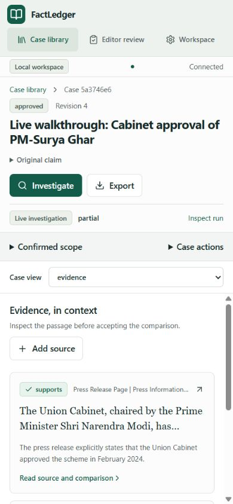

# Interface design

FactLedger keeps the claim, original records and uncertainty close together. The interface is an investigation workbench: restrained colour, readable text and clear status labels put scrutiny ahead of decoration.

## Layout and hierarchy

The application shell separates the case library, active workbench, editor review and workspace settings. A case uses focused views for investigation, evidence, sources and conclusion instead of one long document. Source/evidence pagination bounds page length. The claim and revision remain visible so edits and decisions have context. Mobile uses a **Case view** selector and stacked controls.

The visual system uses the shared tokens and typography in `apps/web/src/styles.css`. Consistent spacing, borders, radii and control heights align forms and cards. Evidence text receives the largest reading area; metadata and actions remain secondary. Status uses text alongside colour so support, contradictions, partial runs and gaps are distinguishable without colour perception.

## Components and states

Shared controls include buttons, form fields, status pills, tabs, dialogs, paginated cards and source readers. The frontend keeps API contracts in `contracts.ts` and centralized transport in `api.ts`; the server remains authoritative for permissions, revisions and job state. Visible run activity explains progress and provider costs. Loading, error and empty states offer concrete actions without inventing results.

Dialogs contain keyboard focus and support Escape; tab controls support keyboard navigation. Forms use labels, visible focus and validation feedback. Original-record reading and quotation navigation are separate from interpretation. Responsive layouts preserve primary actions without requiring horizontal page scrolling.

Motion is limited to feedback and state transitions. Reduced motion is respected. Long-running research shows durable status rather than a decorative animation suggesting progress. Captured source text is rendered as text; exports escape untrusted content.

## Evidence presentation

An evidence card presents the relation, literal quotation, source identity and comparison gaps. **Jump to quotation** connects the claim back to preserved extraction text. Synthetic sources and manual additions retain visible provenance. Editorial review displays a frozen revision; local role switching is explicitly development-only. Approval records an editorial decision about a qualified conclusion and does not certify real-world conditions.

These screenshots document an earlier live walkthrough with a manually attached PIB record. They are examples of the interface, not a guarantee of future search results or provider availability.
