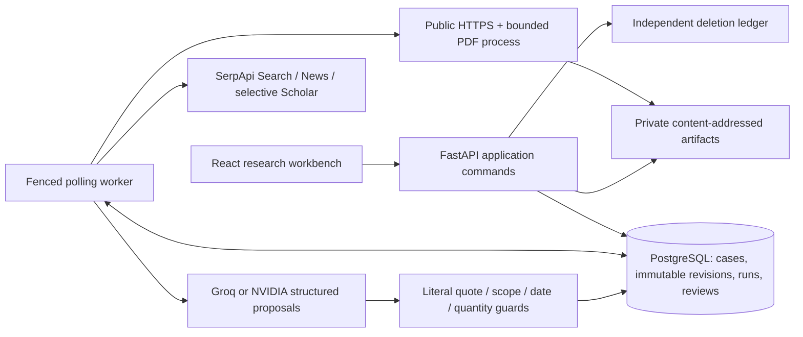

# Implemented release and verification record

Implemented and verified locally; the final product name is **FactLedger**. The [release audit](release-readiness.md) supersedes the historical measurements below. At the latest supplied checkpoint, backend regressions numbered 149, PostgreSQL evaluations 14 and frontend tests 19; final release evidence is recorded in that audit. Older planning documents describe intended targets and are not evidence that those targets passed.

## Product delivered

The researcher can create/search/archive a case, confirm up to three atomic claims, inspect the pinned discovery plan, run synthetic or live research, pause/resume/cancel work, inspect preserved quotes, explicitly integrate results, correct comparable interpretations, maintain source families and notes, and submit a frozen conclusion. A different editor can inspect the cited originals and approve or return that revision. JSON, Markdown and escaped HTML packs preserve review status, quotes, source hashes, search provenance and run usage. Changing the draft does not change existing reviews or exports. Owner controls protect the last owner; deletion revokes authenticated downloads and restore respects the grace period.

Live discovery materially depends on SerpApi. Search snippets remain discovery metadata; fetched document text and literal quote offsets are required for evidence. Automated findings are qualified assessments of collected records, not certifications of ground reality. Inauguration is distinct from operation; funding allocation, sanction, release and expenditure stay separate; quantities use Decimal conversions and compatible units/scope. Missing and opposing evidence remain visible.

## Actual architecture

Domain comparison code is separate from provider/acquisition infrastructure and transactional HTTP commands. PostgreSQL durable jobs replace the initially proposed Redis transport; private local artifact volumes replace MinIO for this local release. Runtime claim/project/ledger collections live in immutable revision JSON envelopes, with relational ownership, source, evidence, job and review records. This trades simpler reproducible snapshots for less flexible cross-case analytical SQL. PostgreSQL row policies are exercised using a non-owner role; local Compose uses a development database owner. Production dispatch enumeration needs the separate privileged worker role described in the runbook.

The frontend uses typed server contracts, TanStack Query for server state, route-based navigation and local transient form state. Its restrained paper/ink/green visual system gives original quotations and human uncertainty prominence. Georgia headings contrast with system sans UI text; comparison rows expose scope instead of burying it in JSON. Responsive navigation, labelled controls, focus handling, keyboard tabs, reduced-motion CSS and loading/error/empty states are implemented. No external font/image service is required.

## Measured verification

| Check | Observed result |
|---|---|
| Backend/domain/acquisition/security/worker regressions | **95 passed**, one upstream Starlette TestClient deprecation warning |
| Operations/evaluation suite with actual PostgreSQL URL | **10 passed**; separate pytest process prevents SQLite test isolation from hiding RLS checks |
| Frontend | **14 passed**, TypeScript and ESLint pass, production build passes |
| Dependency audits | Runtime pinned Python lock and production pnpm dependencies: no known vulnerabilities reported by pip-audit/pnpm audit at verification time |
| Docker | Multi-stage build; UID10001; read-only root filesystem, private writable data/tmp, dropped capabilities/no new privileges, CPU/memory/process limits; loopback API8008/PostgreSQL5432; API readiness and worker healthy |
| Migration drift | `alembic check`: no new upgrade operations detected |
| PostgreSQL HTTP smoke | Worker completion, literal anchor, integration, stale edit rejection, distinct editor approval, immutable export and deletion/download denial passed |
| Browser journey | Create/scope/fixture run/integrate/source reader/conclusion/editor approval/export exercised in packaged UI; [desktop proof](demo/editor-review.jpg); downloaded [approved pack](demo/evidence-pack-r3.json) verified against canonical manifest and [synthetic source bytes](demo/source-record.txt) |
| Responsive check | Review rendered at1440×900 and390×844; mobile document width375px equalled scroll width375px; temporary viewport reset |
| Concurrency smoke | Five concurrent starts:202,202,429,429,429;30 total local requests; p50 134.4ms, p95 316.1ms, max316.5ms; synthetic cases deleted |
| Recovery drill | Isolated PostgreSQL/artifact restore preserved hashes and replayed a later independent deletion; case/source/export stayed inaccessible |

`scripts/load_fixture.py` is a small admission/read regression, not a million-user capacity benchmark. Independent screen-reader auditing, real infrastructure load and remote CI execution remain unverified.

## Live provider proof

Case `9b028f71-3619-4afd-b8dd-33151b732337`, run `62792772-d87e-4947-9326-2488c8dc14c7`: a benign public PM-Surya Ghar approval claim was investigated through the running PostgreSQL worker. Two SerpApi attempts, two document attempts and8645 model tokens produced two validated literal quotes from an acquired public page. The model treated announcement/launch passages as CONTEXT rather than Cabinet approval. An opposing search returned a provider rejection after an acknowledged search ID, and another source was unavailable. The run stopped **PARTIAL**, with `BUDGET_EXHAUSTED:documents`, after30.773 accounted seconds. Estimated configured cost was$0.035554; this is not a provider billing statement. Partial results were explicitly integrated into revision3.

Async search submission IDs are persisted before archive polling. A crash-after-ACK regression verifies recovery without another search charge. The initial synchronous network attempt timed out; it is not represented as successful live evidence. Groq `openai/gpt-oss-120b` was authenticated and exercised; the originally proposed model was unavailable on this account. NVIDIA is an implemented selectable adapter, but its configured key presence is not a live-model verification claim.

## Review corrections and safety evidence

Independent review identified and regression tests fixed deterministic-guard bypass through relation overrides, confirmed-scope version metadata resubmission, future operation dates supporting earlier claims, missing opposing-discovery coverage, ambiguous same-revision approved conclusions, missing hosted sign-in and cross-case admission races. Historical status now derives from that revision's review; stage-only quantities may be omitted; malformed integration inputs return422 instead of500. Daily spending reserves active run budgets under a workspace lock; storage byte quotas use a cross-process lock and count raw plus extracted bytes. Read-only container startup exposed an unconditional local-directory creation in PostgreSQL initialization; it was corrected and a subprocess regression added. The hardened image subsequently passed the complete fixture workflow and real PDF/upload/download/deletion smoke.

Tenant case/source/export access returns404 across workspaces. Existing sessions lose access after membership revocation. CSRF and origin checks reject unauthorized mutations; production disables development identities and fails closed on missing deployment identity configuration. HTML export escapes untrusted text. SSRF checks reject credentials, private/loopback/link-local addresses, mixed DNS answers and unapproved ports, and pin the validated public connection. PDF parsing is bounded by page/text/time/memory limits with network calls disabled. Provider keys never enter browser contracts, search provenance or the repository.

The parser process is not a separately proven OS filesystem sandbox. Scanned PDFs have no OCR, complex table-cell interpretation has not been independently verified, and access-blocked documents remain unavailable. A signed session is not a substitute for a verified hosted OIDC deployment. Local rate windows and filesystem quota enumeration suit the bounded local deployment; multi-host scaling requires shared storage, coordinated ingress rate limits, an appropriate dispatch identity and measured deployment tests. No full production-security or WCAG-conformance claim is made.

## Submission and release gates

All five judging criteria are mapped in [submission readiness](submission-readiness.md). The engineering story is source-grounded research with an inspectable stage/quantity ledger and immutable human review, supported by durable recovery rather than a search-summary wrapper.

The owner authorized repository release to [sankalp2515/FactLedger](https://github.com/sankalp2515/FactLedger) and selected the [MIT License](../LICENSE). Publication and public accessibility are verified. Fresh remote Compose/frontend checks passed; all three remote CI jobs passed at code commit `a1b84d0815a6d19c99a58a9aba75a13c649b2c24` ([verified run](https://github.com/sankalp2515/FactLedger/actions/runs/37932859762)). Demo recording/upload, participant eligibility/details, agreement acceptance and final contest entry remain participant-owned. Independent 100-pair adjudication and a customer pilot remain unmet product-validation goals, not contest prerequisites. The evaluation protocol is implemented; absent human labels are not replaced with invented accuracy. Hosted OIDC/TLS/alerts/backups require a verified deployment before real newsroom use. See the [submission checklist](submission-checklist.md).
