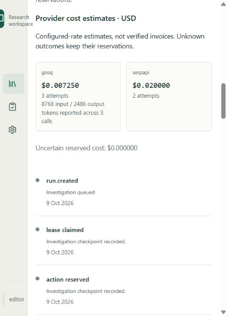

# Manual testing and judge walkthrough

FactLedger helps a researcher and an editor assess what public records establish about a scoped claim. Good cases distinguish approval from delivery, allocation from spending, inauguration from operation, and training from employment. It is an evidence workspace: search snippets are discovery leads, models propose candidates, preserved quotations must pass deterministic guards, and an editor reviews the frozen conclusion.

## Start the entire application

Install Docker Desktop with Linux containers and Docker Compose 2.24+. From the repository root:

```sh
docker compose up --build -d
```

This builds the React frontend into the API image, starts PostgreSQL, applies Alembic migrations and starts API/worker. Open [FactLedger locally](http://127.0.0.1:8008) after the API becomes healthy. `docker compose ps` shows status; an exited migration container with exit code 0 is expected. No local Python/Node installation is necessary to run the stack.

Fixture mode works without `.env`. For live mode, configure the root `.env` once using `.env.example`: `SERPAPI_API_KEY`, `GROQ_API_KEY` or `NVIDIA_API_KEY` for the selected `LLM_PROVIDER`, the corresponding `LLM_MODEL`, and a private `SESSION_SECRET`. Existing keys are sufficient; both LLM providers are not required for one run. Reapply the same startup command after configuration changes. Never paste credentials into the browser, README or issue reports. Local development identities simulate roles; public hosting requires the production runbook's authentication and deployment gates.

## Real public-record case

**Claim:** The Union Cabinet approved PM-Surya Ghar: Muft Bijli Yojana in February 2024.

The [PIB release](https://www.pib.gov.in/PressReleasePage.aspx?PRID=2010130&lang=2&reg=48), posted 29 February 2024, records Cabinet approval. Its launch date is a different event. The programme's target number of households is not a delivered-installation count. This narrow claim avoids conflating these facts.

1. **Choose researcher.** In **Workspace**, select the local Researcher identity. Open **Case library → New case**. Set the title to `Manual test: PM-Surya Ghar approval` and paste the claim into **Original claim**. Create the case.
2. **Confirm scope.** Use the scope editor and enter the fields below. Leave measure, value, unit, currency, denominator and attribution empty. Save the confirmed scope. Expect a new immutable revision.

| Field | Value |
|---|---|
| Subject | `PM-Surya Ghar: Muft Bijli Yojana` |
| Geography | `India` |
| Period | `2024-02` |
| Asserted stage | `APPROVED` |

3. **Begin with no attached sources.** Do not paste the known PIB URL into the default judge case. The search-only flow tests whether live discovery and extraction establish the expected approval finding. Optional manual-source mode is described separately below.
4. **Run live discovery.** Choose **Investigate → Generate research plan**. Inspect the primary-record and opposing queries. Choose **Live search and original records** in **Investigation mode**. Set the following limits before clicking **Start investigation**. The USD field is an estimate based on server-configured rates.

| Limit | Small walkthrough value |
|---|---:|
| Search limit | 2 |
| Document limit | 6 |
| Round limit | 1 |
| Token limit | 60000 |
| Time limit (seconds) | 180 |
| USD estimate limit | 0.25 |

5. **Inspect the run.** Open **Inspect run** and **activity**. Expect live mode, durable activity, bounded usage and separate SerpApi/LLM estimates. The six-document allowance bounds acquired attempts; unavailable URLs can consume it. `PARTIAL / BUDGET_EXHAUSTED:documents` records that stop, but does not meet an expected approval finding. Provider errors remain visible; completed empty discovery is not proof that no opposing evidence exists. Model rate limits can leave conservative reservations. Do not retry repeatedly just to force a favourable finding.
6. **Integrate and examine evidence.** Choose **Integrate results** after the run becomes terminal. Open each evidence card. Read the preserved text and highlight, inspect the original URL/date and delivery-stage comparison, and use **Download original** to inspect the source. A literal quotation supporting approval should remain separate from a contextual launch statement. Check **families**, **Delivery stages** and **gaps**. An automated `INSUFFICIENT_EVIDENCE` finding can coexist with one supporting quotation when material coverage is missing.
7. **Write a qualified conclusion.** In **Conclusion**, write your own assessment and select only citations you inspected. For example, state that the preserved official record supports Cabinet approval in February 2024, while the search is bounded and does not verify delivered installations. If no decisive evidence was collected, explicitly say so. Submit for editorial review. Expect the conclusion, citations and case revision to freeze.
8. **Review as editor.** Switch to Editor in **Workspace**, then open **Editor review**. Select the matching case ID/revision, inspect the frozen scope, quotations, gaps and submitted conclusion. Approve a suitably qualified conclusion or return it with a specific reason. A researcher attempting to approve their own submission must receive a denial. Local role switching demonstrates authorization, not an independent human audit.
9. **Export.** From the case choose **Export → JSON** and download the pack. Expect revision-bound scope, evidence, review, source hashes, run usage and `costs`. The approved pack may still report partial research; approval is an editorial decision about the qualified conclusion. A hash establishes byte identity, not source authenticity.

The same workflow applies to a hospital inauguration versus operations claim, a budget allocation versus spending claim, and a training versus placement count. Use precise geography/date/stage and quantities; do not substitute a related target or announcement for the asserted outcome. Scanned PDFs require OCR outside this release, and private/internal documents should not be sent to a model without appropriate authorization.

### Optional manual-source mode

Use a separate clearly labelled manual-source case when a known record must be inspected directly. In **Evidence**, choose **Add source → Source URL**, paste the official release into **Public source URL**, leave PDF ranges empty and choose **Acquire source**. The preserved source creates another revision and retains manual provenance; it is not proof of SerpApi discovery. If acquisition fails, retain the failure and, where permitted, use **Upload PDF** or another original public record with inspected extraction. Continue through live research, integration, qualified review and export. The historical four-document measurements below used this attachment-assisted mode and remain unchanged.

## No-cost fixture alternative

Create a case with the explicitly synthetic claim `Hospital A is operational in District A during September 2026.` Confirm subject `Hospital A`, geography `District A`, period `2026-09`, stage `OPERATIONAL`, and leave quantities blank. Choose **Synthetic fixture · evaluation only**. Complete integration, source inspection, qualified review, separate editor decision and export as above. Expect an inauguration/operation distinction and explicit synthetic labels; the example establishes no real-world fact and makes no provider calls.

Developers can repeat the full no-cost HTTP/API/worker journey:

```sh
python scripts/smoke_fixture.py --base-url http://127.0.0.1:8008
```

The opt-in real-record script uses local development roles, retains its case for inspection, invokes configured providers, and writes private QA reports/packs under ignored `.execution/`:

```sh
python scripts/smoke_live.py --live --search-only --scenario approval --max-usd 0.25
```

These scripts require the project's installed Python environment and are verification tools, not extra startup commands. `--live` is deliberately explicit and is never enabled in CI. The estimate ceiling does not override external account billing. Both role decisions in the script are AI-operated QA simulation, not independent human review.

For backward-compatible optional manual-source verification, omit `--search-only`:

```sh
python scripts/smoke_live.py --live --scenario approval --max-usd 0.25
```

That mode attaches a known primary URL and must be presented as manual-assisted. It is separate from the default search-only retrieval/evaluation test.

## Additional manual checks

| Check | Expected behaviour |
|---|---|
| Set USD to 0, clear a limit, or enter 13 searches | Start is disabled; server validation also rejects invalid bounds |
| Submit the same start key and payload twice | Same run ID; no second investigation |
| Change scope while another tab uses an older revision | Conflict; old results cannot overwrite changed scope |
| Pause then resume an active run | Durable checkpoint; completed/acknowledged paid calls are not silently resubmitted |
| Cancel | Stops new dispatch; already submitted external work may still incur costs |
| Inspect an unavailable/scanned source | Explicit capture/extraction limitation; no fabricated quotation |
| Researcher approves own review | Authorization denial |
| Edit a draft after exporting a reviewed revision | Existing downloaded export bytes stay immutable |
| Soft-delete your own disposable test case | Case/source/export downloads are denied until authorized restore |
| Keyboard through dialogs/tabs | Visible focus, focus containment, Escape close and arrow-key tab navigation |

## Logs and cost accounting

**Operational logs:** `docker compose logs -f --tail=100 api worker` shows JSON records such as `request.completed`, `request.failed`, `worker.dispatch`, `worker.poll_failed`, and `run.finished`. Fields include UTC timestamp, request ID or run/workspace ID, route template, HTTP method/status, duration and safe error class. Raw URL queries, credentials, exception messages, claims, source text and prompts are not included in these records. Default Uvicorn request-access logging is disabled in Compose. HTTP/worker boundaries still record safe failures; they do not expose raw exception content.

**Retention:** Docker's `json-file` driver rotates at 10 MB and retains three files per service. This is a size cap, not a guaranteed number of days or a centralized archive. Container recreation can discard those logs. PostgreSQL audit/revision/run-event records persist on the database volume; original artifacts and exports persist on a separate private volume. For hosted operations, add protected log shipping/metrics/alerts and retention policies using the production runbook. Avoid logging full `docker compose config` or container environments because those can contain secrets.

**Accounting:** Action reservations are persisted before dispatch and reconciled idempotently. Search estimates use `SERPAPI_SEARCH_USD` per attempt; actual subscription/cached-search billing may differ. LLM estimates use reported prompt/completion tokens and `LLM_INPUT_USD_PER_MILLION`/`LLM_OUTPUT_USD_PER_MILLION` when both fields are valid. The run pins rates, provider and model at start. Missing usage or an unknown invocation outcome keeps its conservative reservation; token totals can consequently mix reported and reserved usage. `uncertain_reserved_usd` makes that uncertainty explicit.

The Activity panel, run API and exports expose per-provider attempts, USD estimates, reported input/output tokens and reported-usage call counts. `invoice_verified` remains false. There is no provider billing-dashboard synchronization in this release. Verify actual charges/credits in the SerpApi, Groq or NVIDIA account dashboard and configure rates for that account; do not present these numbers as measured invoices.

Historical runs retain their recorded totals and may lack pinned pricing or token splits. New reporting does not retroactively repair unknown historical costs. Billing-grade workspace invoices, permanent telemetry storage and independent field validation are separate requirements.

## Historical manual-assisted verification

On 9 October 2026 IST, a live SerpApi/Groq run of the claim above completed the workflow through separate local-role review and JSON export. The first bounded run (`17ce679b-1584-4771-a00b-2542d885126f`) inspected 4 documents, reserved 2 searches and recorded 26359 total reported/reserved tokens in 28.372 seconds. It verified 3 literal anchors and 4 original-download hashes, idempotent start and self-approval denial. Estimate: $0.0367368 ($0.020000 SerpApi; $0.0167368 Groq), including $0.0204738 uncertain reservations. It ended partial at the document limit.

Inspection of the acknowledged SerpApi archive showed `Success` with an empty-news-result message. That was incorrectly classified as a provider failure; the adapter now recognizes exact engine-specific empty-success messages and keeps other errors as failures. Groq also returned HTTP 429 for one attempt, which remains visible and conservatively reserved. The first frozen pack retains this historical record; it is not rewritten after the fix.

These are functional QA checks using real public records and live providers. They do not measure independent factual accuracy, establish exhaustive coverage or constitute independent editorial adjudication. See [release readiness](release-readiness.md) for the refreshed regression/build and live retest results.

**Retest after the fix:** run `ea94e4db-2059-4a5b-97ce-aa88f842f8f1` on 9 October IST completed both search attempts without provider errors. Three Groq calls reported 8768 input + 2486 output tokens, for 11254 total tokens. It recorded 4 document attempts, 33.465 seconds and $0.0272496 total configured estimate ($0.020000 SerpApi + $0.0072496 Groq); uncertain reserved USD was zero. Three literal anchors and three successful original-download hashes passed; one source was unavailable. Self approval was denied, separate local-role review and JSON export succeeded, and all provider estimates summed to the run total.

The run still ended `PARTIAL / BUDGET_EXHAUSTED:documents`. The model selected contextual/subsidy passages with subject/period mismatches, so the deterministic finding remained `INSUFFICIENT_EVIDENCE`. This is a real quality limitation even though the official approval record is available. A judge should inspect the source and qualification rather than expect a guaranteed positive automated verdict. No candidate was silently upgraded to make the demonstration look successful.



## Search-only verification checkpoints

The first two search-only approval runs used two searches and six document attempts without a manual URL. Both ended `PARTIAL / BUDGET_EXHAUSTED:documents` and failed the expected `SUPPORTED_BY_COLLECTED_EVIDENCE` result. The second had no provider errors, 8,694 reported tokens, 17.575 seconds, three anchors, three download-hash checks and a $0.025755 configured estimate with zero uncertain reservation. Removing rate limits alone did not resolve the retrieval/evaluation quality failure.

**Final query-refinement retest:** run `71dab61d-a01b-425c-9584-b4444fb5e3d6` completed with `SUPPORTED_BY_COLLECTED_EVIDENCE`: two searches, two document attempts, 4,763 reported tokens, 8.244 seconds and a $0.0230872 configured estimate, no provider errors and zero uncertain reservations. Two anchors and two original-download hashes validated. Both accepted anchors came from the secondary article at pmsvy-cloud.in, including its approval statement scoped to February 2024. The acquired government-hosted PDF was unrelated election-expense material and supplied no accepted evidence. Primary-record discovery remains a gap. An editor should inspect the official PIB release through the clearly labelled optional manual-source flow; this positive finding against a collected secondary article is not independent truth confirmation or an accuracy benchmark. The delivery-target and earlier-period follow-ups are inconclusive because of provider failures and incomplete document evidence. See the [sanitized release report](release-readiness.md) and [demo script](demo-script.md); raw private QA payloads are not publication artifacts.


## Compact interface walkthrough

On desktop use the case tabs; on mobile choose the same view from **Case view**. **Evidence** contains paginated previews. Open a card for the full quote, rationale and comparison; **Jump to quotation** positions the preserved source pane at its literal anchor. **Sources** contains captured originals. Expand **Confirmed scope**, **Original claim** and **Case actions** as needed. In editor review, switch **Conclusion / Evidence / Gaps**, inspect a cited source, then dismiss the dialog to return to the decision. Activity keeps provider costs visible and groups checkpoints under **Run event history**.

For the full frontend regression procedure and known scope of accessibility verification, see the [UI/UX audit](ui-ux-audit.md).
