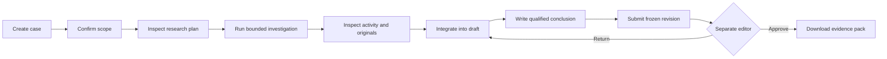

# User flows

FactLedger supports a researcher-to-editor workflow for public claims. It is useful when approval is confused with delivery, allocation with expenditure, inauguration with operation, or training with employment.

## First investigation

1. Start the application as described in the [README](../README.md). Open **Workspace** and select the local Researcher identity.
2. Open **Case library → New case**, enter a title and original claim.
3. Confirm subject, geography, period and asserted stage. Add quantity fields only when the claim actually asserts them.
4. Open **Investigate → Generate research plan**. Inspect primary-record and opposing queries. Select live research or the visibly labelled synthetic fixture.
5. Set search, document, round, token, duration and estimated USD limits. Start research and open **Inspect run** to see durable activity, failures and costs.
6. Integrate terminal results. In **Evidence**, inspect comparisons and **Jump to quotation**. In **Sources**, inspect preserved text, original URL, extraction limitations and **Download original**. Search snippets are leads, not source evidence.
7. Write a qualified conclusion, select inspected citations and submit it for review.
8. Switch to Editor in **Workspace → Editor review**. Inspect the frozen scope, evidence, gaps and conclusion. Approve or return with a reason; the submitter cannot approve their own work.
9. From the case, choose **Export → JSON** or Markdown. The pack binds its case revision, evidence, sources, review and usage. Later draft edits do not rewrite it.

## Real public-record example

Claim: **The Union Cabinet approved PM-Surya Ghar: Muft Bijli Yojana in February 2024.** Confirm subject `PM-Surya Ghar: Muft Bijli Yojana`, geography `India`, period `2024-02`, stage `APPROVED`; leave quantities blank.

Start without attached sources to inspect live SerpApi discovery. A small run can use 2 searches, 6 document attempts, 1 round, 60,000 tokens, 180 seconds and $0.25 configured estimate. Increase the USD allowance only if your configured provider rates require it. Acquisition/provider availability changes; a successful workflow does not guarantee a decisive finding or primary-source discovery.

The [official PIB release](https://www.pib.gov.in/PressReleasePage.aspx?PRID=2010130&lang=2&reg=48) is an approval record. If it is not discovered, use **Add source → Source URL → Public source URL → Acquire source** to inspect it manually. That source retains manual provenance. Approval does not establish later installed households. A secondary quotation is not independent primary confirmation.

## Key-free example

Use the synthetic claim **Hospital A is operational in District A during September 2026.** Confirm subject `Hospital A`, geography `District A`, period `2026-09`, stage `OPERATIONAL`. Choose **Synthetic fixture · evaluation only**. Inspect how an inauguration record fails to establish operation, then complete qualified review and export. Fixtures are fictional and make no provider calls.

## Recoverable states

Partial research preserves useful records and exposes the stop reason. Pause/resume retains checkpoints and budget usage. Cancellation stops new work; already submitted provider calls can still incur costs. A revision conflict requires reloading and inspecting changed scope before integration. Returned review requires a new draft revision before resubmission. Soft deletion denies case/source/export access; authorized restore is subject to retention and purge state.

On mobile, use **Case view** to move between workbench sections. Evidence and sources are paginated; loading, empty and failure states explain the next action. See [interface design](design.md).
